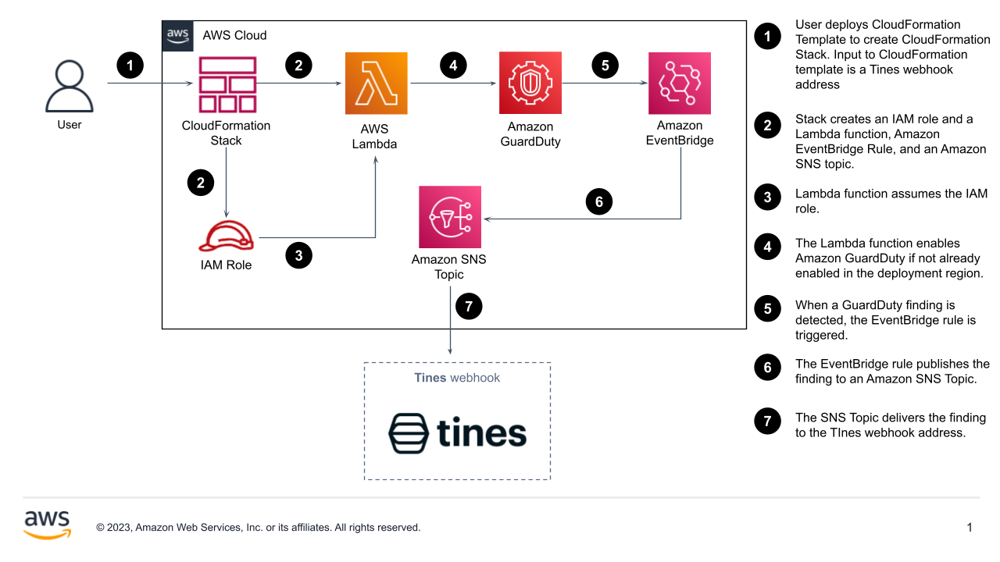

This Quick Start enables {partner-product-short-name} integrations with Amazon GuardDuty, Amazon EventBridge, and Amazon SNS.

// Replace this example diagram with your own. Send us your source PowerPoint file. Be sure to follow our guidelines here : http://(we should include these points on our contributors giude)
:xrefstyle: short
[#architecture1]
.Quick Start architecture for {partner-product-short-name} on AWS

As shown in <<architecture1>>, the Quick Start for {partner-product-short-name} Security sets up the following three deployment options:

* Amazon GuardDuty, Amazon EventBridge, and Amazon SNS integration with {partner-product-short-name} with GuardDuty findings being sent to a Tines webhook.

// Add bullet points for any additional components that are included in the deployment. Make sure that the additional components are also represented in the architecture diagram. End each bullet with a period.
// * <describe any additional components>.

// [.small]#*The template that deploys the Quick Start into an existing VPC skips the components marked by asterisks and prompts you for your existing VPC configuration.#
